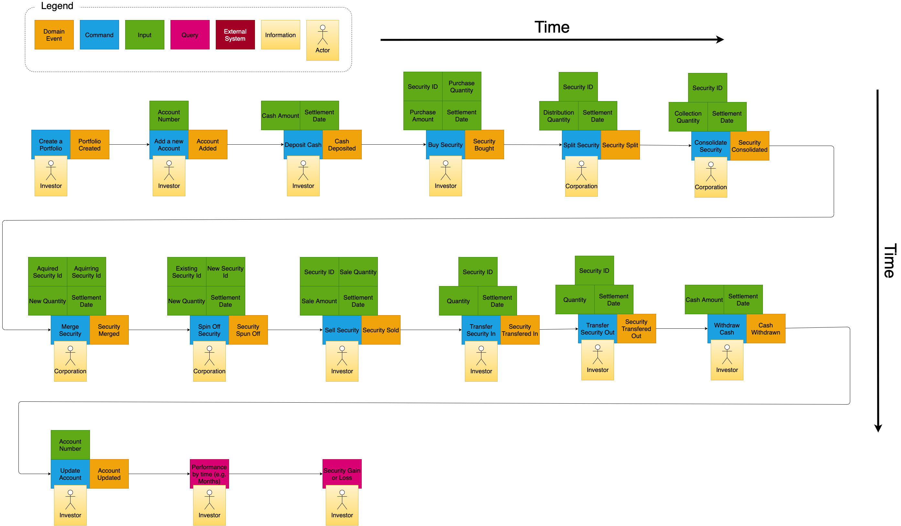

# A learning event log for EventSourcing and EventStore
## Motivation
At some point over the last two years I became fascinated with EventSourcing.  It started with a talk from Martin Fowler that I watched while doing research on Event Driven Architecture in preparation for a heavy transaction based project. [1](#footnotes) Based on this talk I 
 Additionally learning Domain Driven Design (DDD) EventSourcing, Command Query Responsibility Segregation (CQRS), Test Driven Development (TDD), Immutables and EventStore

## The Business Problem

### Event Storm

## Learning event log

### Event processing should not throw exceptions #eventSourcing
3.26.2021 -  My first implementation of the portfolio-event-process threw exceptions for invalid states.  It became clear to me after this implementation that if a stream ever was serialized in a way that created an invalid state then there would be no way to recover the existing stream.  One of the key tenants to the event processor is that it should throw no exceptions.  It is not the job of the event processor to validate if events were serialized correctly. The challenge with throwing exceptions in the event processor is that there is no way to recover.  Events are immutable and you cannot inject an new event into the middle of the stream.  It is append only so corrections can only be made to the end of the stream of events.  That means validation has to occur prior to appending new events and exception notifications can be thrown in the UI after state is calculated to indicate a correction event needs to be appended.  For example: selling a security before it exists in the account should create a security with a negative quantity even though this is an invalid state.  It is the aggregate root object that should validate data consistency before serializing the event. 

### My attempt at loose coupling did no such thing #tdd #functionalProgramming
3.28.2021 - I am just now trying to implement snapshot functionality with the EventStore.  I am running into refactoring challenges because of the object layered implementation which I learned in my Object Oriented Design days.  I had been taught a long time ago that dependency injection with good interface design would allow loose coupling.  What I recognize now is that dependency injection only allows me to change the encapsulated implementation of the dependency but does not help at all when the interface needs to evolve due to the natural way that code refactoring and business requirements evolve during the initial implementation.  Dependency injection does allow me to swap out implementations once the interface is mature.  I waited until now to implement snapshot functionality which should be fine and acceptable because I focused first on the business logic.  I did not yet need to worry about the I/O utility of snapshots.  I think we all too often do not recognize that some of the terminology and goals we are trying to achieve is on a spectrum and not binary.  For example "Loose Coupling" seems easy to understand but it really needs a clearer definition.  What I want is to be able implement something as utility as snapshots without having to refactor all my objects nor my test cases.  If I find that I do have to do this even with dependency injection then I have not achieved "loose coupling" at all.  My research tells me this is the whole point of functional programming.  Building atomic-idempotent functions does not require interfaces.  What I am curious to discover, however, is whether piping of functions creates the same contractual dependencies as interfaces.  For example if I have two functions g(x) and h(x) and if I pipe the functions as g(h(x)) I have now made g(x) dependent on the output of h(x).  My guess is that I will need to try and avoid objects or structures being returned from my functions.  Perhaps just returning tuples will all lose coupling even further.  Based on all of the above I have decided that once I am done with this implementation I will refactor the entire project with the objective of having no mocks and trying to implement as declarative rather than imperative as possible.

### Exception are not very readable nor expressive #functionalProgramming #tdd
3.29.2021 - One thing I noticed when re-reading the code is that exception handling via the try catch throw pattern is not very expressive about possibilities or intention.  My personal pattern is to catch exceptions at the top of the call stack.  In this case I plan on catching all exceptions in the controller.  When building my test cases this becomes a little bit problematic for me in terms of expressiveness.  The controller is part of the I/O utility stack and therefore is not in the business logic stack.  My unit tests are focused to validate the business logic.  No where in the method signatures of my classes does it indicate where exceptions are thrown.  Even if it did it is not clear how each class in the call stack might be effected by a thrown exception.  A bit of research on this high-lighted the Either pattern (I like this blog post on it: https://www.thoughtworks.com/insights/blog/either-data-type-alternative-throwing-exceptions).  I had become aware of this pattern without realizing it while learning golang. I will attempt to use the Either pattern for error handling in my node.js refactor.

### Control mocking via config variable #tdd
3.29.2021 - Jest controls mocks by placing the mock object in the __mocks__ directory of the directory which the mock target exists.  In this case esdb.js is in the db directory so the structure looks like this:

> ./db/esdb.js 
> ./db/__mocks__/esdb.js

In my test case file I put the following code:
    jest.mock('../db/esdb')
This line tells Jest to use the mock implementation of esdb rather than the real implementation of esdb.  What I have been doing is commenting out the the jest.mock() line while developing so that my test cases execute against my real local implementation of EventStore. What I want to do is make this a switchable option so that I do not have to comment out all jest.mock lines when I want to switch from the mock implementation rather than the real implementation.  Unfortunately, but rightly so, Jest validates all cli inputs.  So it is not easy to use a command line switch.  Something like the following would be nice:

    npm test --unmockAll

I did see a blog post showing how to do this but it seemed like a lot of work to achieve when using an environment variable achieves the same goal and is a lot less work.  What I did instead was add the following the test.json file in my config directory.

        "testConfig" : {
        "unmockAll": false
    }

Then change the const ESDB = require() to var ESDB = require() and add the following lines after the jest.mock
    
    jest.mock('../db/esdb');
    if(config.hasOwnProperty("testConfig") && config.testConfig.hasOwnProperty("unmockAll") && config.testConfig.unmockAll) {
        ESDB = jest.requireActual('../db/esdb');
    }

Yes, getting this mock setup and working correctly has a lot of work and it feels unnecessary.  I'm quite convinced that I will be able to refactor this project to not have to use mocks for I/O utilities like EventStore or Grpc.  Those are well tested and well supported software packages so no need to include them in my unit tests.

### Start developing from the real entry point #tdd
4.1.2021 - I started developing the input which will parse a csv file downloaded from a financial brokers website.  The file contains the activity on the brokerage account.  After doing this I realized I have missed some important input fields.  I recognize that using TDD you should start with the open api for anything you are building so that you can minimize test cases and minimize unnecessary code.  Again my OO days essentially taught me to build each class as if it were a library that someone else might someday use.  Clearly in this example it has causes lots of unnecessary code specifically test cases.  The first iteration of the nodejs OO version of the service I started from the bottom up.  Mainly because I was trying to learn EventStore.  I believe this was a mistake and that I should have actually started with the CSV parser and determined what methods I needed to call from the parser that the service should support.  I do know that if I had taken this approach it would not have been perfect.  I would not have recognized that I need expectedRevision in my API call until after implementing the EventStore code which would have been last and that would have caused me to have to add that field in all other layers of my code.  Still that would have been a much simpler change then what I am now facing.  

### Oops.  I forgot about Investors.
4.24.2021 - Some how in my event storm I just assume investors magically appear but alas they need a service to create an investor account and it needs to link to portfolios.  I do not think I can make the root aggregate investor as a investors and portfolios have a many-to-many relationship.  A single investor could own multiple portfolios and a single portfolio could have multiple investors.  I've updated the event storm to v2

### Verify Unique Investors
4.24.2021 - I love event sourcing and I'm really digging the event store.  Where it does pose a bit more of a challenge over an RDBMS is when trying to solve a unique constraint.  Specifically when you are trying to create a unique identifier for an Investor (in our current business case).  You could create a stream naming pattern that uses email address.  For example user_andrew@fakeemail.com and then when a new Investor account is created you check for the no_stream expectedRevision so you will get an error if it exists.  I don't want to use email address as email addresses can change and I sometimes find it convenient to have multiple system accounts linked to the same email address.  I see two options.  1) Create a unique uuid for each account.  On account creation create a stream with the uuid e.g. user_<uuid>.  Create a projection into a cache (e.g. redis) that looks up the uuid via username.  When accounts are created lookup into the cache to see if the username is unique.  This would allow the event store to hold a stream without having to migrate to a new stream on username change.  This is more complexity then I want to deal with right now so I'm going to go with option two.  2) Just have the user select a unique username (duh).  Then you get stream_<username> and don't allow them to change it or accept the technical hit of migrating to a new stream should it change (you would have to migrate all events to the new stream and, if you store a username reference in the portfolio aggregate you would have to update those references as well).

### I know I should this already be obvious but... start with the UI
4.24.2021 - My point is really to start with the most public API as some teams can't start with the UI if they are not a UI team but since I'm doing this whole thing myself the most public interface is the UI since I should have started there at the start I'm going to go ahead and start there now.  Long terms, as with everything else I'm doing here, I will implement multiple versions of the UI for comparison.  React, Angular, and maybe Blazor (might give me an opportunity to flex my long dormant C# muscles.  I do miss C#).

### Authentication and Auth0
4.25.2021 - In researching how I wanted to approach implementation of JWT authentication I came across Auth0 (auth0.com) which looks kinda bad-ass.  There is a free tier so you can setup and use their authentication as a service for an app like I'm building here.  Small project with just a few users.  Perfect!  I will likely, however, not use it for this project as I'm doing this to keep my coding/technology chops up-to-date (Since I moved into Technology leadership I do keep my hands in a code a bit but not anywhere near what I would like) and I want to learn and do as much as I can on my own.  Auth0 looks like a great option for any future apps that I build as SOC2, HIPAA, compliance, etc. are taken care of as well as physical and software infrastructure.  Frankly Authentication is a commodity.  It's a must have that does not provide any unique functionality so if you can pay for a service and free up your engineering team to focus on features why not use it?!? There are plenty of opensource auth projects our there.  I am going to select Keycloak and use OAuth2.0/OIDC/JWT to manage credentials and serve as the Authentication Service for this app.

### SMTP relay server
5.1.2021 - I want to go ahead and configure keycloak to SMTP in order to use the registration and verification features.  Keycloak provides everything you need out of the box for authentication and authorization management so I'm going to stick with using the keycloak ui for all things security.  SMTP is needed to complete the full experience.  I'm not interested in running my own SMTP server so I'm going to use a relay server.  After a bit of research I like sendgrid.net.  100 emails a day for the free account and the setup was relatively easy.  My isp blocks port 25 so sendgrid.net offers additional port both un-secure and secure protocols which allowed me to get this setup relatively quickly.  I'm going to need to come up with an appropriate secrets and configuration strategy (I'm assuming via Hashicorp vault for the secrets) as I don't want to commit the keys for send grid or my account details to the github.  I will need to merge those values at runtime.  If I was running this on K8 it would be easy to use that secrets vault but I don't want to introduce the K8 infrastructure at this time.  As this is a learning exercise that I hope others can use I will stick to docker.  

## The rest of this section should be pulled into a separate file and linked for those interested in logging, metrics, jmeter, etc.

### grpcurl and app Logging
I have finished wiring up the controller and routed all the controller methods to the GrpcServer.  I'm now testing the GrpcServer itself using grpcurl (https://github.com/fullstorydev/grpcurl).  This seems to be the most straight forward method of testing gRPC.  I am running into some errors and realize I need some logging output on the nodejs server.  In looking for something familiar it looks like winston is the most log4j like package.  Not sure if that's the right nodejs like pattern to use but coming from the Java world it's what I'm used to so I'll try that first.

### Footnotes:
1. GOTO 2017 • The Many Meanings of Event-Driven Architecture • Martin Fowler - https://www.youtube.com/watch?v=STKCRSUsyP0

### DEPLOYMENT READY TO INCLUDE ANALYTIC PROJECTIONS TODOs
* TODO:  Need to add to projections capital gains and short term gains minus fees and commissions
* TODO:  Make sure to understand how to manage events so that no events are lost but also db size is managed
* TODO:  Make sure security number translations are accounted for (should be)
* TODO:  Build Security Service for collecting daily unit price of securities

### REFACTOR TODOs
* TODO:  Document EventStorming
* TODO:  Document Domain Ubiquitous Language
* TODO:  Complete C Level Architecture and put some language in the documentation related to C Level
* TODO:  Create a unit test without actually using ESDB to prove out whether it was important to mock it or not
* TODO:  Duplicate the project and implement a refactor to do it without mocks to compare
* TODO:  Do Commissions need to be a separate event from fees paid
* TODO:  Remove full path from json config so that the proto file is a relative path
* TODO:  Build a seperate example project to test uuidv4() function and whether it causes the open handle RANDOMBYTESREQUEST error in Jest by itself.  If it does enter a question or bug with uuidv4()
* TODO:  Confirm that license should be changed to the GNU license (copyleft)